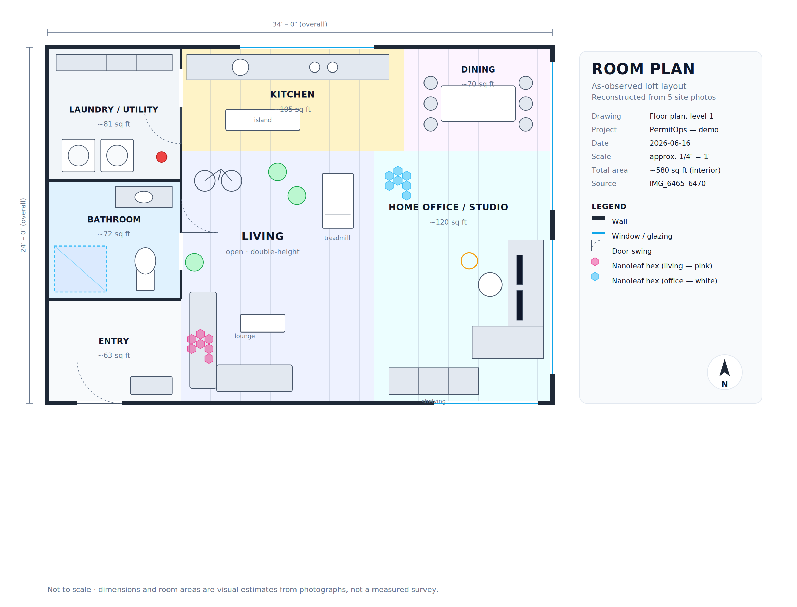

# Room Plan — as-observed loft

A floor plan reconstructed from five site photos (`IMG_6465`–`IMG_6470`). The
space reads as a **double-height loft** with one open great room (living + home
office/studio + kitchen/dining) and a service core holding a bathroom and a
laundry/utility room off the entry.



> **Not a survey.** Dimensions and areas are visual estimates from photographs.
> Wall positions, openings, and room sizes are approximate and should be
> field-verified before any permit or construction use.

## Files

| File | What it is |
| --- | --- |
| `room-plan.png` | Rendered floor plan (2× raster) |
| `room-plan.svg` | Vector source — edit or rescale without quality loss |
| `generate_plan.py` | Script that builds the SVG/PNG (`python3 generate_plan.py`) |

Regenerate after edits:

```bash
pip install cairosvg pillow
python3 generate_plan.py
```

## Room schedule

| Room | Approx. area | Observed in | Key contents |
| --- | --- | --- | --- |
| **Living** (open) | double-height | IMG_6470, IMG_6465 | Velvet sectional, treadmill, road bike, large plants, **pink** Nanoleaf hex panels |
| **Home office / studio** | ~120 sq ft | IMG_6465 | L-desk at window, dual monitors, task chair, ring light, IKEA-Kallax cube shelving, **white** Nanoleaf hex panels |
| **Kitchen** | ~105 sq ft | IMG_6466 | Counter run with sink + cooktop, island/bar cart, wood-plank ceiling |
| **Dining** | ~70 sq ft | IMG_6466 | Table with 6 chairs by the window |
| **Bathroom** | ~72 sq ft | IMG_6468 | Glass walk-in shower, toilet, vanity + mirror, tile floor |
| **Laundry / utility** | ~81 sq ft | IMG_6467 | Side-by-side front-load washer + dryer, storage shelving, fire extinguisher |
| **Entry** | ~63 sq ft | — | Front door, bench/landing |
| **Interior total** | ~580 sq ft | | |

## How the layout was inferred

- The **concrete accent wall** and **wood-plank double-height ceiling** appear
  across the office, kitchen, and living photos — so those three are one
  connected open volume, not separate rooms.
- The **Nanoleaf hex panels** anchor two zones of that volume: white panels by
  the studio desk (IMG_6465), pink panels over the living lounge (IMG_6470).
- The **bathroom** and **laundry** are the only fully enclosed rooms; they sit
  back-to-back in the service core to share a plumbing wall.
- Large **glazing** runs along the right/exterior wall (garage-style and tall
  windows visible in IMG_6465 and IMG_6466).

Orientation (north arrow) is assumed — there was no compass reference in the
photos.
